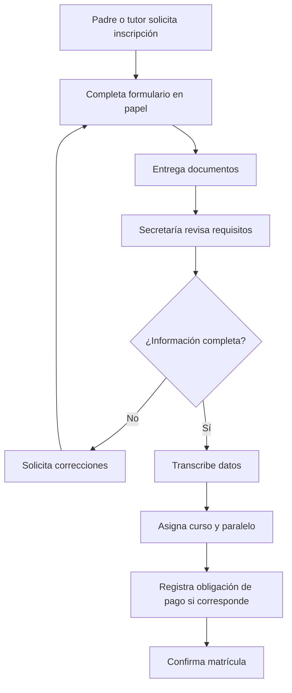

# Diagrama de actividades

El primer proceso que se modelará es la matrícula actual:

El diagrama evidencia revisión manual, retrabajo y doble digitación. En el sistema futuro, Estudiantes y Matrículas gestionarán la inscripción; Finanzas manejará por separado el cobro relacionado.
