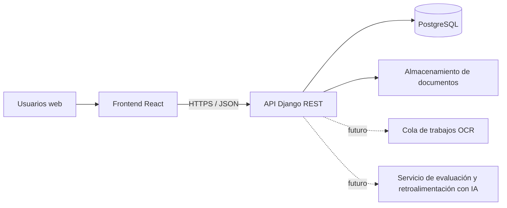

# Modelo inicial

Entidades iniciales: Usuario, Rol, Permiso, Institución, Plan y Suscripción. Sobre esa base se incorporarán Personal, Ambiente, Gestión académica, Curso, Paralelo, Materia, Estudiante, Matrícula, Asistencia, Calificación, Concepto de cobro, Pago y Movimiento de caja.

Para la ampliación de evaluaciones asistidas se contemplan las entidades Evaluación, Pregunta, Intento, Respuesta, Rúbrica y Retroalimentación. Sus relaciones y atributos se detallarán cuando la ampliación sea priorizada.

Todas las entidades institucionales deberán estar vinculadas directa o indirectamente con una institución.
