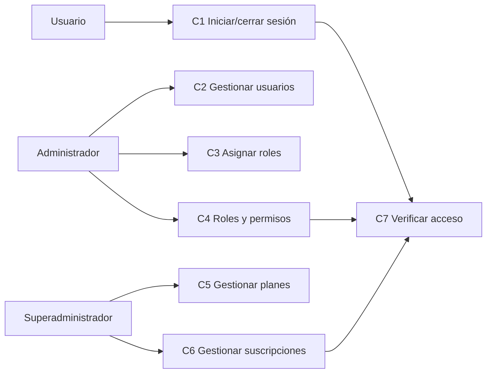

# Casos de uso

Actores: Usuario, Administrador institucional y Superadministrador.

```mermaid
flowchart LR
    U[Usuario] --> C1[C1 Iniciar/cerrar sesión]
    A[Administrador] --> C2[C2 Gestionar usuarios]
    A --> C3[C3 Asignar roles]
    A --> C4[C4 Roles y permisos]
    SA[Superadministrador] --> C5[C5 Gestionar planes]
    SA --> C6[C6 Gestionar suscripciones]
    C1 --> C7[C7 Verificar acceso]
    C4 --> C7
    C6 --> C7
```
