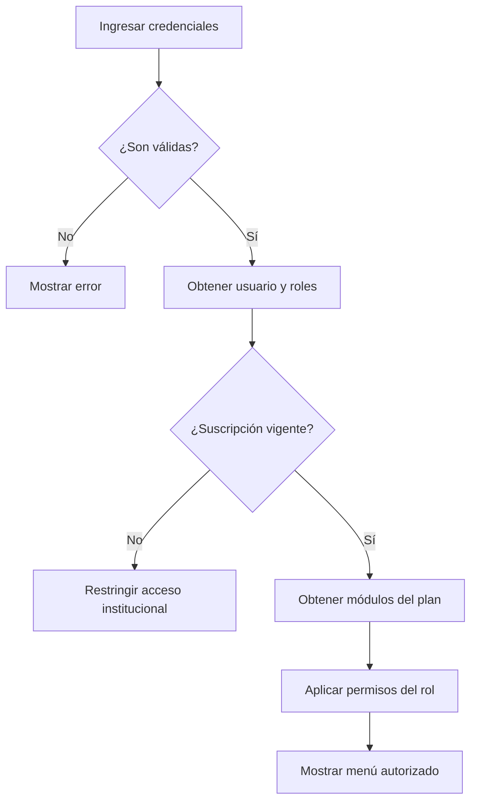

# Actividad

```mermaid
flowchart TD
    A[Ingresar credenciales] --> B{¿Son válidas?}
    B -- No --> C[Mostrar error]
    B -- Sí --> D[Obtener usuario y roles]
    D --> E{¿Suscripción vigente?}
    E -- No --> F[Restringir acceso institucional]
    E -- Sí --> G[Obtener módulos del plan]
    G --> H[Aplicar permisos del rol]
    H --> I[Mostrar menú autorizado]
```
