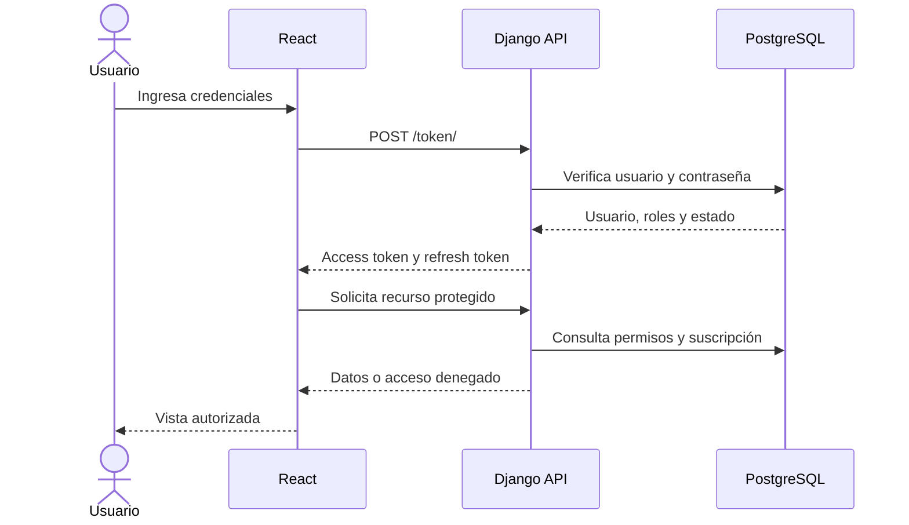

# Secuencia

```mermaid
sequenceDiagram
    actor Usuario
    participant Web as React
    participant API as Django API
    participant DB as PostgreSQL
    Usuario->>Web: Ingresa credenciales
    Web->>API: POST /token/
    API->>DB: Verifica usuario y contraseña
    DB-->>API: Usuario, roles y estado
    API-->>Web: Access token y refresh token
    Web->>API: Solicita recurso protegido
    API->>DB: Consulta permisos y suscripción
    API-->>Web: Datos o acceso denegado
    Web-->>Usuario: Vista autorizada
```
