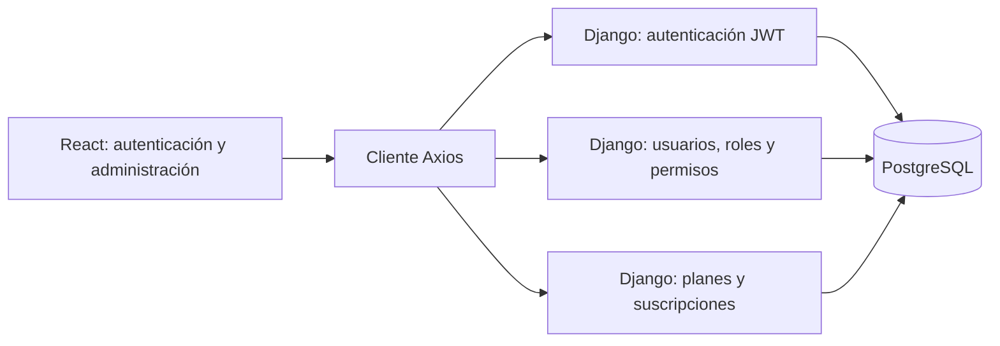

# Componentes

```mermaid
flowchart LR
    UI[React: autenticación y administración] --> HTTP[Cliente Axios]
    HTTP --> AUTH[Django: autenticación JWT]
    HTTP --> IAM[Django: usuarios, roles y permisos]
    HTTP --> BILL[Django: planes y suscripciones]
    AUTH --> DB[(PostgreSQL)]
    IAM --> DB
    BILL --> DB
```
