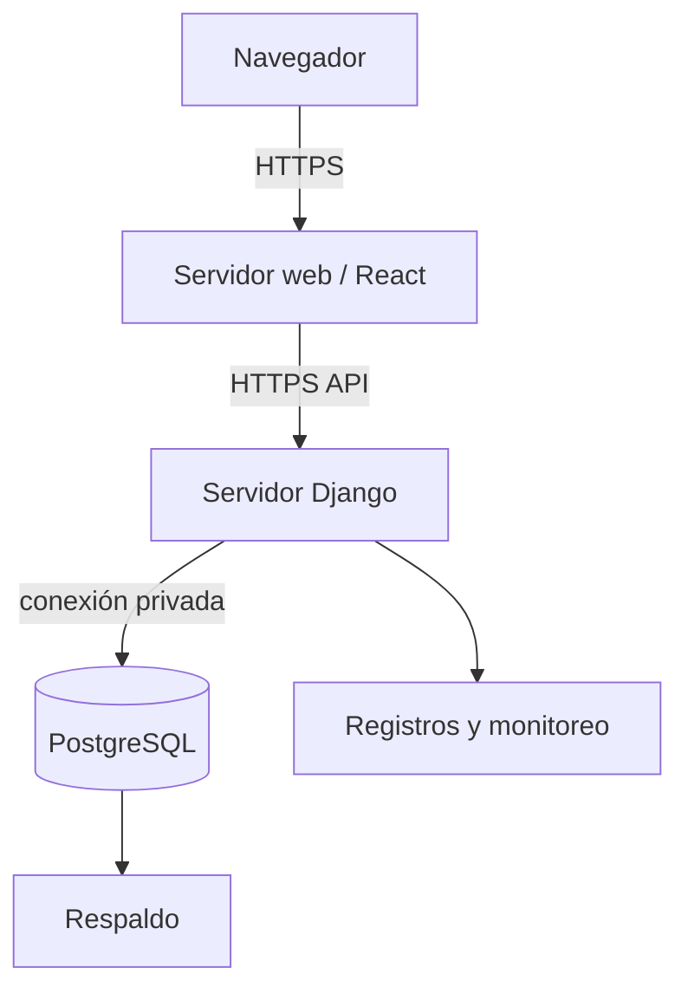

# Despliegue

```mermaid
flowchart TB
    B[Navegador] -->|HTTPS| W[Servidor web / React]
    W -->|HTTPS API| A[Servidor Django]
    A -->|conexión privada| P[(PostgreSQL)]
    A --> L[Registros y monitoreo]
    P --> R[Respaldo]
```

El entorno local puede ejecutar frontend y backend por separado; producción deberá proteger la base de datos de accesos públicos directos.
