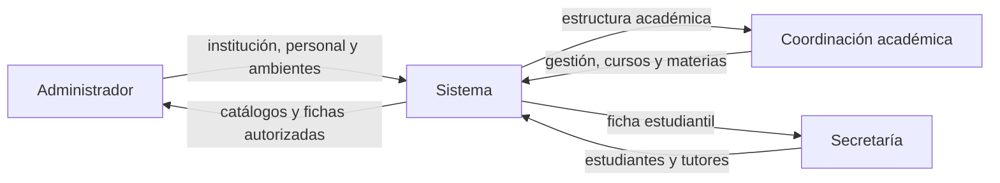

# Diagrama de contexto

```mermaid
flowchart LR
    A[Administrador] -->|institución, personal y ambientes| S[Sistema]
    C[Coordinación académica] -->|gestión, cursos y materias| S
    SE[Secretaría] -->|estudiantes y tutores| S
    S -->|catálogos y fichas autorizadas| A
    S -->|estructura académica| C
    S -->|ficha estudiantil| SE
```
