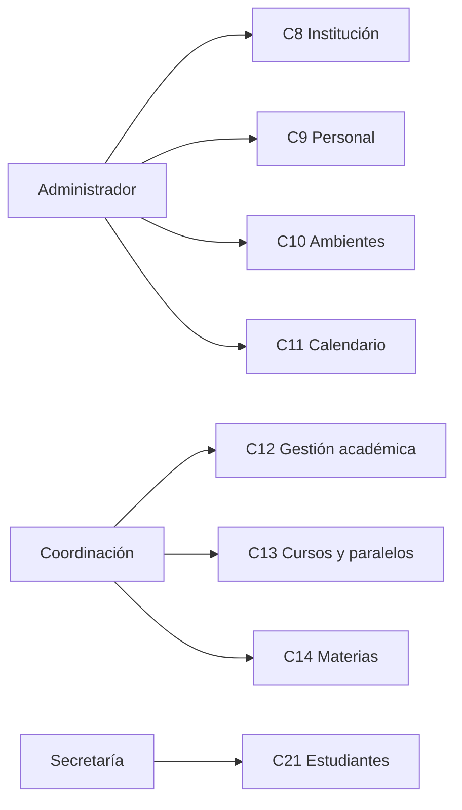

# Casos de uso

```mermaid
flowchart LR
    A[Administrador] --> C8[C8 Institución]
    A --> C9[C9 Personal]
    A --> C10[C10 Ambientes]
    A --> C11[C11 Calendario]
    CO[Coordinación] --> C12[C12 Gestión académica]
    CO --> C13[C13 Cursos y paralelos]
    CO --> C14[C14 Materias]
    S[Secretaría] --> C21[C21 Estudiantes]
```
