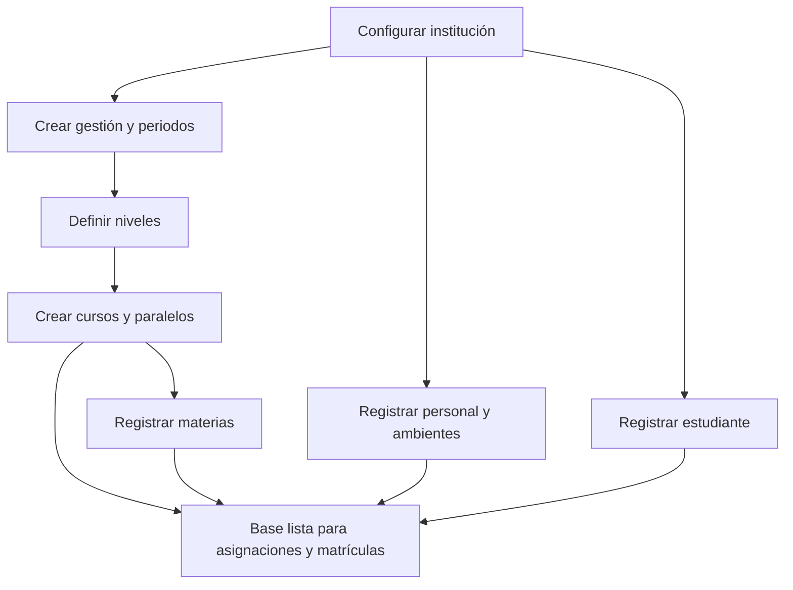

# Actividad

```mermaid
flowchart TD
    A[Configurar institución] --> B[Crear gestión y periodos]
    B --> C[Definir niveles]
    C --> D[Crear cursos y paralelos]
    D --> E[Registrar materias]
    A --> F[Registrar personal y ambientes]
    A --> G[Registrar estudiante]
    D --> H[Base lista para asignaciones y matrículas]
    E --> H
    F --> H
    G --> H
```
