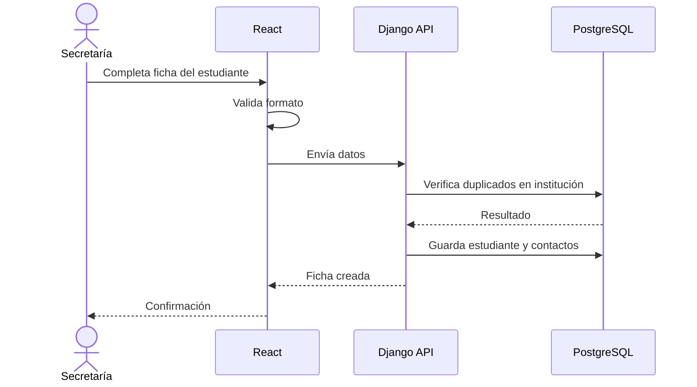

# Secuencia

```mermaid
sequenceDiagram
    actor Secretaria as Secretaría
    participant Web as React
    participant API as Django API
    participant DB as PostgreSQL
    Secretaria->>Web: Completa ficha del estudiante
    Web->>Web: Valida formato
    Web->>API: Envía datos
    API->>DB: Verifica duplicados en institución
    DB-->>API: Resultado
    API->>DB: Guarda estudiante y contactos
    API-->>Web: Ficha creada
    Web-->>Secretaria: Confirmación
```
