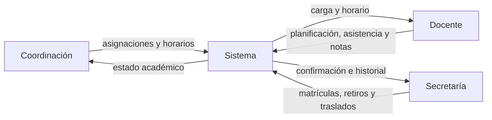

# Diagrama de contexto

```mermaid
flowchart LR
    C[Coordinación] -->|asignaciones y horarios| S[Sistema]
    D[Docente] -->|planificación, asistencia y notas| S
    SE[Secretaría] -->|matrículas, retiros y traslados| S
    S -->|carga y horario| D
    S -->|estado académico| C
    S -->|confirmación e historial| SE
```
