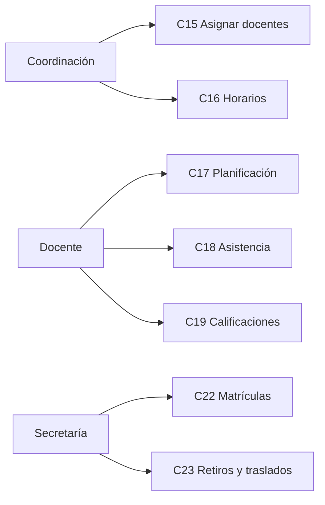

# Casos de uso

```mermaid
flowchart LR
    CO[Coordinación] --> C15[C15 Asignar docentes]
    CO --> C16[C16 Horarios]
    D[Docente] --> C17[C17 Planificación]
    D --> C18[C18 Asistencia]
    D --> C19[C19 Calificaciones]
    S[Secretaría] --> C22[C22 Matrículas]
    S --> C23[C23 Retiros y traslados]
```
