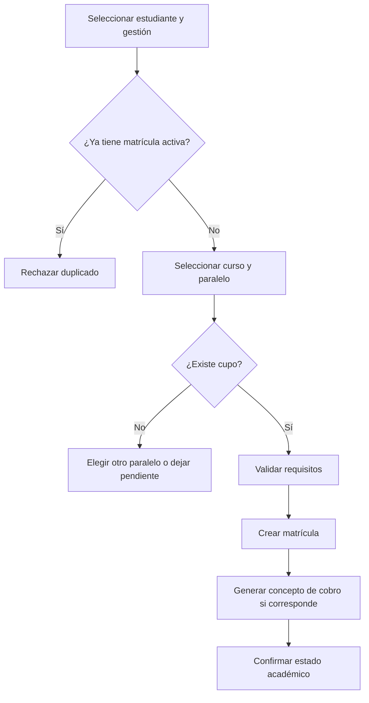

# Actividad

```mermaid
flowchart TD
    A[Seleccionar estudiante y gestión] --> B{¿Ya tiene matrícula activa?}
    B -- Sí --> C[Rechazar duplicado]
    B -- No --> D[Seleccionar curso y paralelo]
    D --> E{¿Existe cupo?}
    E -- No --> F[Elegir otro paralelo o dejar pendiente]
    E -- Sí --> G[Validar requisitos]
    G --> H[Crear matrícula]
    H --> I[Generar concepto de cobro si corresponde]
    I --> J[Confirmar estado académico]
```
