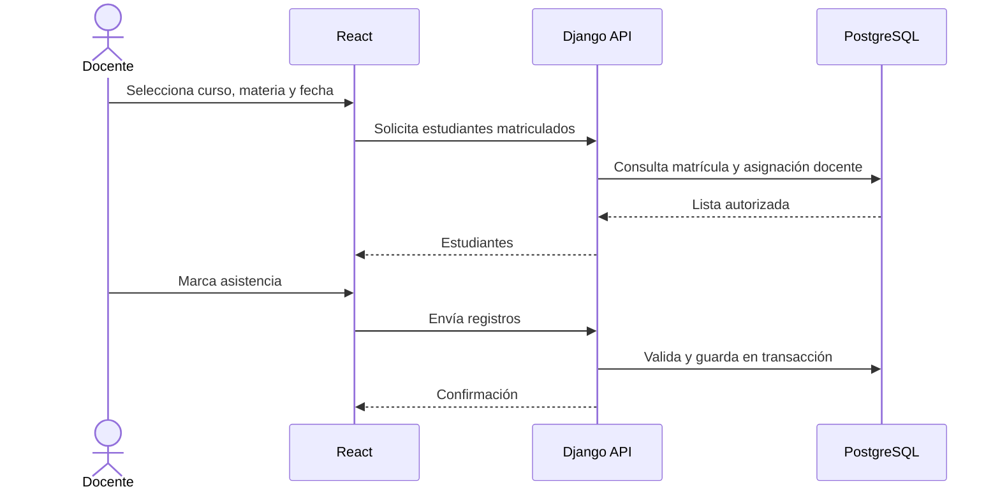

# Secuencia

```mermaid
sequenceDiagram
    actor Docente
    participant Web as React
    participant API as Django API
    participant DB as PostgreSQL
    Docente->>Web: Selecciona curso, materia y fecha
    Web->>API: Solicita estudiantes matriculados
    API->>DB: Consulta matrícula y asignación docente
    DB-->>API: Lista autorizada
    API-->>Web: Estudiantes
    Docente->>Web: Marca asistencia
    Web->>API: Envía registros
    API->>DB: Valida y guarda en transacción
    API-->>Web: Confirmación
```
