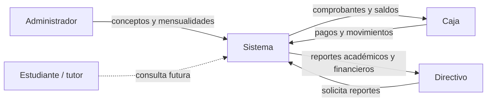

# Diagrama de contexto

```mermaid
flowchart LR
    A[Administrador] -->|conceptos y mensualidades| S[Sistema]
    C[Caja] -->|pagos y movimientos| S
    D[Directivo] -->|solicita reportes| S
    S -->|comprobantes y saldos| C
    S -->|reportes académicos y financieros| D
    E[Estudiante / tutor] -. consulta futura .-> S
```
