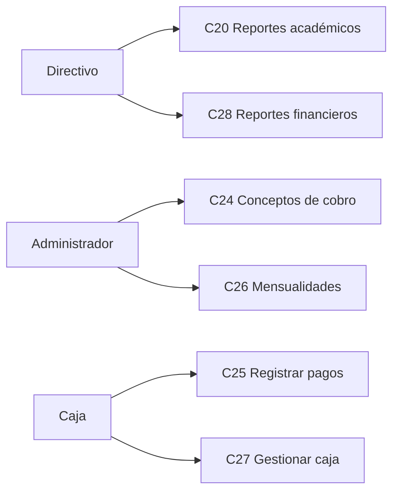

# Casos de uso

```mermaid
flowchart LR
    D[Directivo] --> C20[C20 Reportes académicos]
    A[Administrador] --> C24[C24 Conceptos de cobro]
    A --> C26[C26 Mensualidades]
    CA[Caja] --> C25[C25 Registrar pagos]
    CA --> C27[C27 Gestionar caja]
    D --> C28[C28 Reportes financieros]
```
