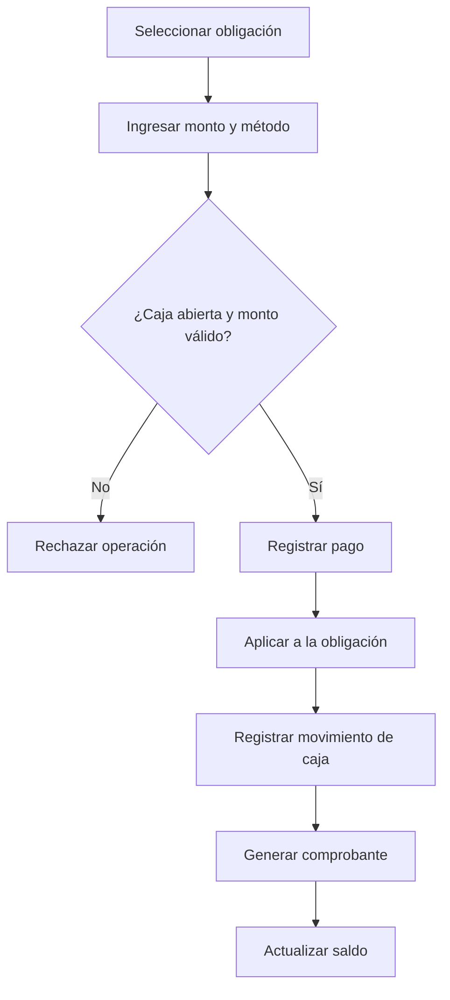

# Actividad

```mermaid
flowchart TD
    A[Seleccionar obligación] --> B[Ingresar monto y método]
    B --> C{¿Caja abierta y monto válido?}
    C -- No --> D[Rechazar operación]
    C -- Sí --> E[Registrar pago]
    E --> F[Aplicar a la obligación]
    F --> G[Registrar movimiento de caja]
    G --> H[Generar comprobante]
    H --> I[Actualizar saldo]
```
