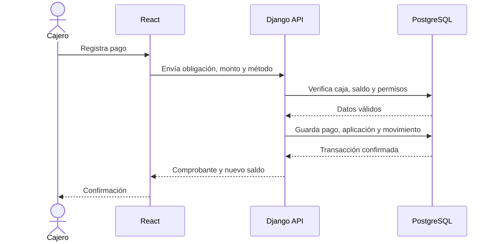

# Secuencia

```mermaid
sequenceDiagram
    actor Cajero
    participant Web as React
    participant API as Django API
    participant DB as PostgreSQL
    Cajero->>Web: Registra pago
    Web->>API: Envía obligación, monto y método
    API->>DB: Verifica caja, saldo y permisos
    DB-->>API: Datos válidos
    API->>DB: Guarda pago, aplicación y movimiento
    DB-->>API: Transacción confirmada
    API-->>Web: Comprobante y nuevo saldo
    Web-->>Cajero: Confirmación
```
